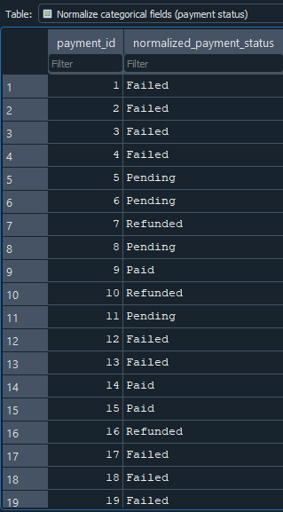
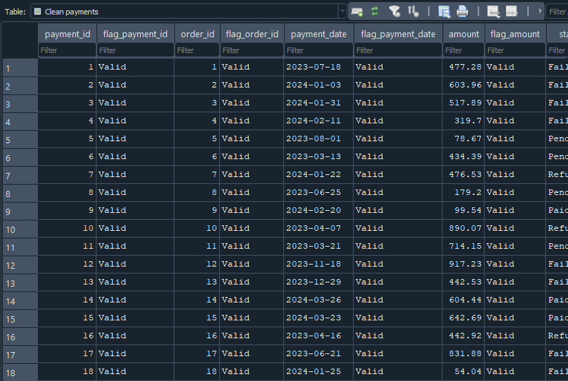

*This SQL project focuses on the end-to-end data cleaning, validation, and analysis of a multi-table sales and support dataset. Using relational data modeling techniques, the project evaluates data quality, enforces consistency across key business entities, and prepares analysis-ready datasets through the creation of structured SQL views.*

*Comprehensive validation checks were implemented to assess data integrity, detect anomalies, and standardize key fields. The cleaned data was then used to support business-oriented analysis, including revenue reporting, customer behavior insights, and operational performance tracking. All transformations and findings are fully reproducible through documented SQL queries.*

---

**Project Name:** Customer & Orders Data Cleaning   
**Dataset Size / Rows:** customers (2000), order\_items (30048), orders (10000), payments (10000), products (200), support\_tickets (5000)  
**Date Completed:** 01/05/2026

---

**Tables, columns & foreign/primary keys in tables:**

    \- customers (FK: None. PK: customer\_id).  
    \- order\_items (FK: order\_id, product\_id. PK: order\_item\_id).  
    \- orders (FK: customer\_id. PK: order\_id).  
    \- payments (FK: order\_id. PK: payment\_id).  
    \- products (FK: None. PK: product\_id).  
    \- support\_tickets (FK: customer\_id, order\_id. PK: ticket\_id).

---

**SCREENSHOTS**

- **Example view queries:**

***1\. View:** Normalized categorical fields (payment status)*

***2\. View:** Clean payments*

---

*All queries used for the analysis are included in the SQL section for reproducibility.*  
      
 #   **SQL QUERIES' CODES**

# **1\.**  
# **Task:** Identify missing values across all tables  
**Code:**

SELECT   
    SUM(CASE WHEN customer\_id IS NULL THEN 1 ELSE 0 END) AS customers\_null,  
    SUM(CASE WHEN order\_id IS NULL THEN 1 ELSE 0 END) AS orders\_null,  
    SUM(CASE WHEN issue\_type IS NULL THEN 1 ELSE 0 END) AS issue\_type\_null,  
    SUM(CASE WHEN status IS NULL THEN 1 ELSE 0 END) AS status\_null,  
    SUM(CASE WHEN created\_date IS NULL THEN 1 ELSE 0 END) AS created\_date\_null,  
    SUM(CASE WHEN resolved\_date IS NULL THEN 1 ELSE 0 END) AS resolved\_date\_null  
FROM support\_tickets;

# **Task:** Detect duplicate records  
**Code:**

SELECT ticket\_id, COUNT(\*) AS occurrences  
FROM support\_tickets

GROUP BY ticket\_id  
HAVING COUNT(\*) \> 1;

# **Task:** Identify inconsistent categorical values  
**Code:**

SELECT DISTINCT status  
FROM support\_tickets

GROUP BY status;

# **Task:** Quantify the extent of data quality issues  
**Code:**

SELECT   
    SUM(CASE WHEN resolved\_date IS NULL THEN 1 ELSE 0 END) AS resolved\_date\_null\_cells,  
    COUNT(\*) AS total\_cells,  
    SUM(CASE WHEN resolved\_date IS NULL THEN 1 ELSE 0 END)\*100.0 / (COUNT(\*)) AS data\_quality\_issues\_rate  
FROM support\_tickets;

# **2\.**  
# **Task:** Check referential integrity between tables  
**Code:**

SELECT c.customer\_id  
FROM customers c  
WHERE NOT EXISTS(  
    SELECT 1  
    FROM orders o  
    WHERE c.customer\_id \= o.customer\_id  
)

GROUP BY c.customer\_id;

# **Task:** Detect duplicate records  
**Code:**

SELECT o.status, COUNT(\*) AS orders\_without\_payment  
FROM orders o  
LEFT JOIN payments pa  
ON o.order\_id \= pa.order\_id  
WHERE pa.order\_id IS NULL

GROUP BY o.status  
ORDER BY orders\_without\_payment;

# **Task:** Identify orphan records or mismatches  
**Code:**

SELECT o.order\_id  
FROM orders o  
LEFT JOIN payments pa  
ON o.order\_id \= pa.order\_id  
WHERE NOT EXISTS(  
	SELECT 1   
	FROM payments pa  
	WHERE o.order\_id \= pa.order\_id  
)

GROUP BY o.order\_id;

# **Task:** Validate logical consistency  
**Code:**

SELECT pa.payment\_id  
FROM payments pa  
JOIN orders o  
ON pa.order\_id \= o.order\_id  
WHERE o.status \!= 'Completed'

GROUP BY pa.payment\_id;

# **Task:** Negative amounts (orders/payments)  
**Code:**

SELECT o.order\_id, pa.payment\_id  
FROM orders o  
JOIN payments pa  
ON o.order\_id \= pa.order\_id

GROUP BY o.order\_id, pa.payment\_id  
HAVING pa.amount \< 0;

# **Task:** Payment dates before order dates  
**Code:**

SELECT pa.payment\_id, pa.payment\_date, o.order\_date  
FROM payments pa  
JOIN orders o  
ON pa.order\_id \= o.order\_id

GROUP BY pa.payment\_id  
HAVING julianday(pa.payment\_date) \< julianday(o.order\_date);

# **Task:** Unusual or inconsistent transaction patterns  
**Code:**

SELECT o.order\_id, SUM(oi.quantity\*p.unit\_price) AS original\_order\_value, pa.amount  
FROM payments pa  
JOIN orders o  
ON pa.order\_id \= o.order\_id  
JOIN order\_items oi  
ON o.order\_id \= oi.order\_id  
JOIN products p  
ON oi.product\_id \= p.product\_id

GROUP BY o.order\_id  
HAVING SUM(oi.quantity\*p.unit\_price) \!= pa.amount;

# **Task:** Normalize categorical fields (payment status)  
**Code:**

SELECT payment\_id,  
CASE LOWER(TRIM(status))  
    WHEN 'failed' THEN 'Failed'  
    WHEN 'pending' THEN 'Pending'  
    WHEN 'refunded' THEN 'Refunded'  
    WHEN 'paid' THEN 'Paid'  
    ELSE 'Unknown'  
END AS normalized\_payment\_status  
FROM payments;

# **Task:** Ensure consistent formatting across fields (case, naming conventions) (order status)  
**Code:**

SELECT order\_id,  
CASE  
    WHEN LOWER(TRIM(status)) IN ('cancelled') THEN 'Cancelled'  
    WHEN LOWER(TRIM(status)) IN ('processing') THEN 'Processing'  
    WHEN LOWER(TRIM(status)) IN ('completed') THEN 'Completed'  
    WHEN LOWER(TRIM(status)) IN ('pending') THEN 'Pending'  
    ELSE 'Unknown'  
END AS consistent\_formatting\_status  
FROM orders;

# **Task:** Standardize key business fields for downstream analysis (text to numeric values, date standardization)  
**Code:**

SELECT payment\_id,  
    \-- Clean numeric  
    CAST(REPLACE(TRIM(amount), ',', '') AS NUMERIC) AS clean\_amount,  
    \-- Clean date  
    CASE   
        WHEN payment\_date LIKE '%/%' THEN DATE(REPLACE(TRIM(payment\_date), '/', '-'))  
        WHEN substr(payment\_date, 3, 1\) \= '-' THEN  
            substr(payment\_date, 7, 4\) || '-' ||   
            substr(payment\_date, 4, 2\) || '-' ||  
            substr(payment\_date, 1, 2\)   
        ELSE DATE(payment\_date)  
END AS clean\_payment\_date  
FROM payments;

# **Task:** Handle missing values (replacing, flagging)  
**Code:**

SELECT ticket\_id,   
CASE  
    WHEN resolved\_date IS NULL THEN 'N/A'  
    ELSE resolved\_date  
END AS clean\_resolved,  
CASE   
    WHEN resolved\_date IS NULL THEN 'Not Resolved'  
    ELSE 'Resolved'  
END AS flag\_resolved\_date  
FROM support\_tickets;

# **Task:** Correct or flag invalid numeric values  
**Code:**

SELECT   
    product\_id,  
    CAST(REPLACE(TRIM(unit\_price), ',', '.') AS NUMERIC) AS correct\_unit\_price,  
    CASE  
        WHEN unit\_price IS NULL THEN 'Invalid'  
        WHEN TRIM(unit\_price) \= '' THEN 'Invalid'  
        WHEN unit\_price GLOB '\*\[A-Za-z\]\*' THEN 'Invalid'  
        WHEN unit\_price LIKE '%,%' THEN 'Invalid'  
        ELSE 'Correct'  
    END AS flag\_unit\_price  
FROM products;

# **Task:** Resolve duplicates where necessary  
**Code:**

WITH duplicates AS(  
    SELECT   
        rowid,  
        ROW\_NUMBER() OVER(PARTITION BY product\_id ORDER BY product\_id) AS count\_product\_id  
    FROM products  
)

DELETE FROM products  
WHERE rowid IN(  
    SELECT rowid   
    FROM duplicates   
    WHERE count\_product\_id \> 1  
);

# **Task:** Clean customers  
**Code:**

SELECT   
    customer\_id,  
    CASE  
        WHEN customer\_id IS NULL THEN 'Invalid'  
        WHEN customer\_id GLOB '\*\[^0-9\]\*' THEN 'Invalid'  
        WHEN COUNT(\*) OVER(PARTITION BY customer\_id) \> 1 THEN 'Duplicate'  
        ELSE 'Valid'  
    END AS flag\_customer\_id,  
    full\_name,  
    CASE  
        WHEN full\_name IS NULL THEN 'Invalid'  
        WHEN TRIM(full\_name) NOT GLOB 'Customer\_\[0-9\]\*' THEN 'Invalid'  
        ELSE 'Valid'  
    END AS flag\_full\_name,  
    email,  
    CASE  
        WHEN email IS NULL THEN 'Invalid'  
        WHEN email NOT LIKE '%@%.%' THEN 'Invalid'  
        WHEN SUBSTR(TRIM(email), \-4) \<\> '.com' THEN 'Invalid'  
        ELSE 'Valid'  
    END AS flag\_email,  
    phone,  
    CASE  
        WHEN phone IS NULL THEN 'Invalid'  
        WHEN SUBSTR(phone, 1, 3\) \<\> '555' THEN 'Invalid'  
        WHEN SUBSTR(phone, 4, 1\) \<\> '-' THEN 'Invalid'  
        WHEN SUBSTR(phone, 5\) GLOB '\*\[^0-9\]\*' THEN 'Invalid'  
        ELSE 'Valid'  
    END AS flag\_phone,  
    country,  
    CASE   
        WHEN country IS NULL THEN 'Invalid'  
        WHEN country NOT IN('Germany', 'Spain', 'Italy', 'Netherlands', 'France', 'UK', 'USA', 'Canada') THEN 'Invalid'  
        ELSE 'Valid'  
    END AS flag\_country,  
    signup\_date,  
    CASE  
        WHEN signup\_date IS NULL THEN 'Invalid'  
        WHEN signup\_date NOT LIKE '\_\_\_\_-\_\_-\_\_' THEN 'Invalid'  
        WHEN DATE(signup\_date) IS NULL THEN 'Invalid'  
        ELSE 'Valid'  
    END AS flag\_signup\_date  
FROM customers;

# **Task:** Clean orders  
**Code:**

SELECT   
    order\_id,  
    CASE  
        WHEN order\_id IS NULL THEN 'Invalid'  
        WHEN order\_id GLOB '\*\[^0-9\]\*' THEN 'Invalid'  
        WHEN COUNT(\*) OVER(PARTITION BY order\_id) \> 1 THEN 'Duplicate'  
        ELSE 'Valid'  
    END AS flag\_order\_id,  
    customer\_id,  
    CASE  
        WHEN customer\_id IS NULL THEN 'Invalid'  
        WHEN customer\_id GLOB '\*\[^0-9\]\*' THEN 'Invalid'  
        ELSE 'Valid'  
    END AS flag\_customer\_id,  
    order\_date,  
    CASE  
        WHEN order\_date IS NULL THEN 'Invalid'  
        WHEN order\_date NOT LIKE '\_\_\_\_-\_\_-\_\_' THEN 'Invalid'  
        WHEN DATE(order\_date) IS NULL THEN 'Invalid'  
        ELSE 'Valid'  
    END AS flag\_order\_date,  
    status,  
    CASE  
        WHEN status NOT IN ('Cancelled', 'Processing', 'Completed', 'Pending') THEN 'Invalid'  
        ELSE 'Valid'  
    END AS flag\_status,  
    sales\_channel,  
    CASE  
        WHEN sales\_channel NOT IN ('Retail', 'Mobile', 'Online') THEN 'Invalid'  
        ELSE 'Valid'  
    END AS flag\_sales\_channel  
FROM orders;

# **Task:** Clean payments  
**Code:**

SELECT   
    payment\_id,  
    CASE  
        WHEN payment\_id IS NULL THEN 'Invalid'  
        WHEN payment\_id GLOB '\*\[^0-9\]\*' THEN 'Invalid'  
        WHEN COUNT(\*) OVER(PARTITION BY payment\_id) \> 1 THEN 'Duplicate'  
        ELSE 'Valid'  
    END AS flag\_payment\_id,  
    order\_id,  
    CASE  
        WHEN order\_id IS NULL THEN 'Invalid'  
        WHEN order\_id GLOB '\*\[^0-9\]\*' THEN 'Invalid'  
        WHEN COUNT(\*) OVER(PARTITION BY order\_id) \> 1 THEN 'Duplicate'  
        ELSE 'Valid'  
    END AS flag\_order\_id,  
    payment\_date,  
    CASE  
        WHEN payment\_date IS NULL THEN 'Invalid'  
        WHEN payment\_date NOT LIKE '\_\_\_\_-\_\_-\_\_' THEN 'Invalid'  
        WHEN DATE(payment\_date) IS NULL THEN 'Invalid'  
        ELSE 'Valid'  
    END AS flag\_payment\_date,  
    amount,  
    CASE  
        WHEN amount IS NULL THEN 'Invalid'  
        WHEN CAST(REPLACE(amount, ',', '.') AS REAL) IS NULL THEN 'Invalid'  
        ELSE 'Valid'  
    END AS flag\_amount,  
    status,  
    CASE  
        WHEN status NOT IN ('Failed', 'Refunded', 'Paid', 'Pending') THEN 'Invalid'  
        ELSE 'Valid'  
    END AS flag\_status  
FROM payments;

# **Task:** Number and % of issues per table  
**Code:**

WITH number\_issues AS (  
    SELECT  
        COUNT(\*) AS total\_rows,  
        SUM(  
            CASE  
                WHEN flag\_customer\_id IN ('Invalid','Duplicate')  
                OR flag\_full\_name \= 'Invalid'  
                OR flag\_email \= 'Invalid'  
                OR flag\_phone \= 'Invalid'  
                OR flag\_country \= 'Invalid'  
                OR flag\_signup\_date \= 'Invalid'  
                THEN 1 ELSE 0  
            END  
        ) AS total\_issues  
    FROM "Clean customers"  
),  
percentage\_issues AS (  
    SELECT ROUND(100.0 \* total\_issues / total\_rows, 2\) AS issues\_rate  
    FROM number\_issues  
)

SELECT \*  
FROM number\_issues  
CROSS JOIN percentage\_issues;

**Task:** Types of issues identified  
**Code:**

SELECT  
    CASE WHEN flag\_customer\_id IN ('Invalid','Duplicate') THEN 'Issue' END AS issues\_customer\_id,  
    CASE WHEN flag\_full\_name \= 'Invalid' THEN 'Issue' END AS issues\_full\_name,  
    CASE WHEN flag\_email \= 'Invalid' THEN 'Issue' END AS issues\_email,  
    CASE WHEN flag\_phone \= 'Invalid' THEN 'Issue' END AS issues\_phone,  
    CASE WHEN flag\_country \= 'Invalid' THEN 'Issue' END AS issues\_country,  
    CASE WHEN flag\_signup\_date \= 'Invalid' THEN 'Issue' END AS issues\_signup\_date  
FROM "Clean customers";

# **Task:** Impacted records  
**Code:**

SELECT   
    SUM(CASE WHEN flag\_customer\_id IN ('Invalid','Duplicate') THEN 1 ELSE 0 END) AS customer\_id\_issues,  
    SUM(CASE WHEN flag\_full\_name \= 'Invalid' THEN 1 ELSE 0 END) AS full\_name\_issues,  
    SUM(CASE WHEN flag\_email \= 'Invalid' THEN 1 ELSE 0 END) AS email\_issues,  
    SUM(CASE WHEN flag\_phone \= 'Invalid' THEN 1 ELSE 0 END) AS phone\_issues,  
    SUM(CASE WHEN flag\_country \= 'Invalid' THEN 1 ELSE 0 END) AS country\_issues,  
    SUM(CASE WHEN flag\_signup\_date \= 'Invalid' THEN 1 ELSE 0 END) AS signup\_date\_issues  
FROM "Clean customers";

**Task:** Revenue reporting  
**Code:**

WITH issue\_data AS (  
    SELECT  
        \*,  
        CASE  
            WHEN flag\_payment\_id IN ('Invalid','Duplicate')  
            OR flag\_order\_id IN ('Invalid','Duplicate')  
            OR flag\_payment\_date \= 'Invalid'  
            OR flag\_amount \= 'Invalid'  
            OR flag\_status \= 'Invalid'  
            THEN 1 ELSE 0  
        END AS is\_issue  
    FROM "Clean payments"  
)

SELECT  
    COUNT(\*) AS total\_rows,  
    SUM(is\_issue) AS total\_issues,  
    ROUND(  
        100.0 \* SUM(is\_issue) / COUNT(\*),  
        2  
    ) AS issues\_rate,  
    ROUND(  
        SUM(  
            CASE   
                WHEN is\_issue \= 1   
                THEN CAST(REPLACE(amount, ',', '.') AS REAL)  
                ELSE 0  
            END  
        ),  
        2  
    ) AS revenue\_at\_risk  
FROM issue\_data;

---

**Analysis & Key Findings:**

**1\. Data Quality Assessment**

**Identify missing values across all tables**: A systematic review of missing values was performed across all tables using SQL queries, applying a consistent approach to assess date completeness. Only the query for the support\_tickets table is shown, as it is the only table where missing values were identified.

The dataset is largely complete, with no NULL values detected in most tables. The only exception is the resolved\_date column in the support\_tickets table, which contains 2,528 missing values. This may indicate gaps or inconsistencies in the ticket resolution process. 

No cleaning actions were applied in this field, as the missing values may reflect ongoing or unresolved tickets. It is assumed that NULL values in resolved\_date correspond to tickets that have not yet been closed, though this should be validated with business context.

**Detect duplicate records (e.g., emails, customers)**: A systematic review of duplicate records was conducted across all tables, focusing on key identifiers such as emails and customer IDs. The same SQL-based approach was applied throughout; however, only the query for the support\_tickets table is shown for clarity, as it is representative of the method used. 

The analysis found no duplicate values in any table, including the support\_tickets table. This indicates a high level of data integrity and suggests that there are no operational discrepancies related to duplicated records.

**Identify inconsistent categorical values (e.g., status fields)**: Categorical values were analyzed across key fields, including customer countries, order status, sales channels, payment status, product categories, and support ticket issue types and statuses. The same SQL-based approach was applied to all fields; however, only the query for the support\_tickets status column is shown for clarity, as it is representative of the method used.

The analysis found no inconsistencies in any of the categorical values across the examined fields. This indicates that the dataset maintains strong integrity with respect to category-level data, and there are no discrepancies that could affect operational reporting or analysis.

**Quantify the extent of data quality issues (% where possible)**: The extent of data quality issues was quantified across all tables. The only issue identified is missing values in the resolved\_date column of the support\_tickets table, representing 7.2% of the table’s records. All other tables and columns were fully populated, resulting in a 0% data quality issue rate for duplicates and categorical values. Overall, this indicates a relatively low level of data quality issues; however, further investigation is recommended to determine the underlying causes of the missing values in support\_tickets and identify potential improvements.

**2\. Data Integrity Validation**

**Check referential integrity between tables (e.g., orders without customers)**: A referential integrity check was performed across customers, orders, payments, and support tickets to assess consistency between key relationships.

No issues were found between orders and payments, indicating strong consistency in the payment process. However, a notable number of customers do not appear in the orders table, and a relatively high number are linked to support tickets. In addition, most orders do not appear in support tickets, which is expected but indicates limited support involvement per order.

Overall, the results suggest generally stable relationships, but the high proportion of customers without orders and the use of support tickets may require further investigation to determine whether this reflects valid business behavior or underlying data or operational issues.

**Identify orphan records or mismatches**: A series of business logic and data consistency checks were performed to identify orphan records, mismatches, and potential operational inconsistencies across key tables.

Initial checks for orphan records and referential mismatches across orders, payments, and related entities returned no results, indicating strong structural integrity and consistent relationships between core tables. Similarly, validation of support ticket logic (e.g., status consistency and lifecycle completeness) did not reveal any anomalies.

However, the timeline sanity check identified multiple inconsistencies between order\_date and payment\_date, where certain orders were recorded with an order date later than the corresponding payment date. This suggests potential data entry issues or system-level timestamp inconsistencies that may require further investigation.

**Validate logical consistency (e.g., payments without orders)**: Logical consistency checks were performed to evaluate alignment between orders and payment records.

The analysis identified a significant number of payments (7,456) associated with orders that are not marked as ‘Completed’. This may indicate inconsistencies in order status updates, timing differences in data recording, or potential process misalignment between order completion and payment processing.

Additionally, a check for multiple payments per order did not return any results, indicating that each order is associated with a single payment record and no duplication issues were detected.

Overall, while payment duplication does not appear to be an issue, the discrepancy between payment records and order completion status suggests potential data consistency or operational timing issues that may require further investigation.

**3\. Anomaly Detection**

Detect invalid or illogical values, including:

* **Negative amounts (orders/payments)**: A validation check was performed to identify negative values in order and payment amounts. No negative values were found across the dataset.  
  This indicates that all monetary values are logically valid, with no data integrity issues detected in relation to order or payment amounts.  
* **Payment dates before order dates**: An analysis was conducted to identify payments recorded before their corresponding order dates. The results show that more than half of the payment records exhibit this inconsistency.  
  This indicates significant data integrity issues, likely related to data entry errors or system processing discrepancies, and warrants further investigation to determine the underlying causes.

* **Unusual or inconsistent transaction patterns**: Transaction consistency was evaluated by comparing order values with corresponding payment amounts. The analysis identified widespread discrepancies between recorded order values and payment amounts, indicating potential inconsistencies in transaction recording that require further investigation.  
  Additionally, 602 orders were found with a ‘Cancelled’ order status but a ‘Paid’ payment status. This inconsistency suggests possible issues in order lifecycle tracking or payment processing logic, warranting further review.

**4\. Standardization**

**Normalize categorical fields (e.g., order status, payment status)**: Categorical fields were reviewed for inconsistencies in formatting and value representation. No significant discrepancies were identified, indicating that category values were already consistently maintained across the dataset.

As part of the validation process, normalization logic was implemented using conditional expressions (CASE) for the payment status field to ensure consistency and demonstrate standardized handling of categorical data.

Ensure consistent formatting across fields (case, naming conventions): Categorical fields were reviewed to ensure consistent casing, spacing, and naming conventions across the dataset. No significant inconsistencies were identified, indicating that values were already standardized.

As part of validation, formatting logic was applied to the order status field to confirm consistency and demonstrate standardized handling.

**Standardize key business fields for downstream analysis**: Although no major formatting inconsistencies were identified during initial validation, key business fields were standardized as part of the final data preparation layer.

Payment amounts were converted from text to numeric format using CAST and REPLACE to ensure correct aggregation and calculation. Additionally, date fields were standardized into a consistent YYYY-MM-DD format using string manipulation functions (e.g., SUBSTR) to align all records to a unified temporal structure.

These transformations were implemented within a single SQL view to ensure a clean, analysis-ready dataset for downstream use. 

**5\. Data Cleaning & Correction**

**Handle missing values (decide whether to remove, replace, or flag)**: Missing values were identified in the resolved\_date field of the support tickets table and addressed using conditional logic. NULL values were replaced with “N/A” to ensure completeness for reporting purposes.

Additionally, a flag column was created to preserve analytical visibility, categorizing records as ‘Resolved’ or ‘Not Resolved’ based on the presence of a resolved date.

No other missing values were identified across the dataset. These gaps may reflect incomplete records or unresolved cases and may require further investigation.

**Correct or flag invalid numerical values**: Numeric fields were validated to identify potential formatting or data integrity issues. The unit\_price field was used as a representative example, where values were standardized by trimming spaces and replacing inconsistent decimal delimiters before converting to numeric format.

In addition, validation logic was implemented to flag invalid entries, including NULL values, empty strings, non-numeric characters (detected using pattern matching), and inconsistent formatting. Records were classified as ‘Correct’ or ‘Invalid’ to support data quality monitoring.

No invalid values were ultimately identified in the dataset, indicating that numeric fields were consistently structured. 

**Resolve duplicates where necessary**: The dataset was reviewed for duplicate records using primary key fields, with no duplicates identified across the tables.

As part of the validation process, duplicate detection logic was implemented on the products table using a window function (ROW\_NUMBER()) with PARTITION BY product\_id to identify potential duplicate entries. Duplicate removal logic was also demonstrated using a CTE and DELETE statement to handle redundant records if present.

This confirms that the dataset maintains strong entity integrity while ensuring that appropriate mechanisms are in place to detect and resolve duplicates when necessary.

**Fix inconsistencies identified in previous steps**: All previously identified areas were reviewed and validated. No additional inconsistencies requiring correction were found, as data quality checks confirmed that fields were consistently structured and aligned across the dataset.

This indicates that the dataset maintains a high level of integrity following the applied validation and standardization steps.

**6\. Create Clean Data Models** 

Build cleaned versions of key tables using views or new tables:

* **Clean customers**: The customers dataset was validated and cleaned to ensure consistency and readiness for analysis. Key fields such as customer\_id, full\_name, email, phone, country, and signup\_date were checked using SQL validation rules, including pattern matching, type checks, and window functions for duplicate detection. No significant inconsistencies were identified, and all records met the expected formats and business rules. The resulting dataset is structured, reliable, and suitable for downstream analytical use.

* **Clean orders**: The orders dataset was validated to ensure consistency and analytical readiness. Key fields, including order\_id, customer\_id, order\_date, status, and sales\_channel, were assessed using SQL validation rules such as pattern matching, null checks, and duplicate detection via window functions. All records conformed to the expected formats and predefined business categories, and no significant inconsistencies were identified. The dataset is therefore considered clean, structured, and suitable for downstream analysis.

* **Clean payments**: The payments dataset was validated to ensure consistency and accuracy across key fields. Attributes including payment\_id, order\_id, payment\_date, amount and status were assessed using SQL validation rules such as null checks, pattern matching, numeric conversion, and duplicate detection via window functions. All records adhered to expected formats and business-defined categories, with no inconsistencies identified. The dataset is clean, structured, and ready for reliable analytical use.

Ensure cleaned data is ready for analytical use.

**7\. Data Quality Reporting**

Produce summary queries showing:

* **Number and % of issues per table**: The customers dataset was evaluated using multiple validation rules covering identifiers, names, emails, phone numbers, country values, and signup dates. No data quality issues were identified across any fields, resulting in a total issue count of 0 and an issue rate of 0%.  
  All validation checks returned no violations, confirming that the dataset is fully consistent and structured correctly for analysis.  
* **Types of issues identified**: No data quality issues were detected across the dataset. All validation checks returned NULL results rather than ‘Issue’, indicating that no records met any of the defined error conditions. This confirms that all fields comply with the established validation rules and no invalid values were identified. 

* **Impacted records**: 0 records were impacted, as all validation checks returned no violations across the dataset. Therefore, no corrections, exclusions, or transformations were required based on data quality issues. 

**8\. Business Impact Assessment**

Identify how data issues could affect:

* **Revenue reporting**: As no data quality issues were identified during validation, no revenue was considered at risk. All payment records complied with the defined validation rules, ensuring that revenue calculations are based on consistent and reliable data. 

* **Customer analysis**: Data quality issues in the customers dataset could significantly impact customer-level analysis and downstream business insights. Since customers are directly linked to orders through the customer\_id, any inconsistencies in customer records (such as invalid or duplicated identifiers) could lead to incorrect joins between customers and orders. This would affect the accuracy of customer segmentation, order history tracking, and behavioral analysis.  
  Furthermore, as orders are linked to payments, any disruption in the customer-order relationship could propagate to payment data, ultimately impacting revenue analysis. Inaccurate customer data could therefore result in misattribution of revenue, incorrect customer lifetime value calculations, and unreliable performance metrics.  
  Although no issues were identified in this dataset, maintaining high data quality in the customers table is essential to ensure consistency and accuracy across all related analytical processes.

* **Operational performance tracking**: Data quality issues could significantly affect operational performance tracking, particularly in processes involving orders and payments. Metrics such as order processing times, payment delays, and overall workflow efficiency rely heavily on accurate date and status fields. Inconsistencies in these values could lead to incorrect measurement of order delays, misinterpretation of process efficiency, and unreliable operational insights.  
  Additionally, inaccuracies in payment status or transaction data could distort revenue tracking and mask potential issues such as failed or delayed payments. For example, transactions incorrectly recorded as ‘Paid’ could lead to overestimated revenue and hide operational inefficiencies in the payment process.  
  Although no data quality issues were identified in this dataset, ensuring consistency across order and payment records is essential for accurate monitoring of operational performance and effective decision-making.

---

**Overall conclusion**

The project demonstrates a structured approach to data cleaning, validation, and preparation within a relational database environment. Through the application of SQL-based validation rules, consistency checks, and standardization techniques, the dataset was confirmed to be well-structured and suitable for analytical use.

Data quality assessment revealed minimal issues, with only isolated cases of missing values in the support\_tickets table and no significant inconsistencies across core business entities such as customers, orders, and payments. Referential integrity and logical consistency checks further confirmed the reliability of relationships between tables.

By transforming and validating the data into clean, analysis-ready formats, the project enables accurate reporting across key business areas, including revenue tracking, customer analysis, and operational performance. Additionally, the implementation of validation frameworks ensures that potential data quality risks can be identified and monitored in future use cases.

Overall, the project highlights the importance of robust data validation and preparation processes as a foundation for reliable analytics and informed decision-making.

